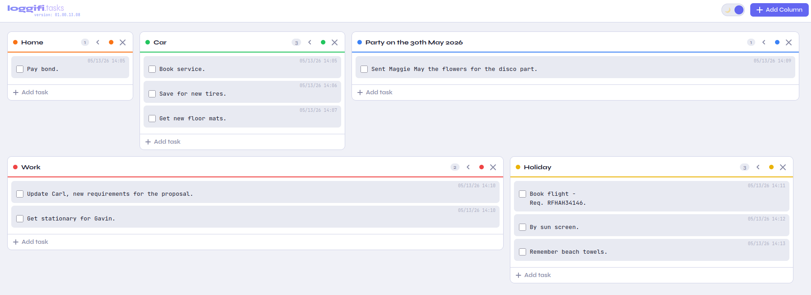

<h1>tasks</h1>
<h2>This is part of my loggifi suite of tools...</h2>

<pre>
tasks: Is a Web UI created via Python and used as a tasks, to do list.
It includes the ability to run over HTTPS if you add certificates,
or it can be configured to run behind a reverse proxy or similar setup.
Includes a dark mode.

Change values in python script as required:
  
DATA_PATH_BASE_DIR = "/var/lib/loggifi"                 <<<<<<<<<< Path to create the SQLite database

CERT_PATH_BASE_DIR = "/opt/loggifi/certs/tasks/"                 <<<<<<<<<< Path to Certificates

DB_PATH   = os.path.join(DATA_PATH_BASE_DIR, "loggifi_tasks.db")                 <<<<<<<<<< SQLite atabase name
CERT_FILE = os.path.join(CERT_PATH_BASE_DIR, "cert.pem")                 <<<<<<<<<< Certificate file name
KEY_FILE  = os.path.join(CERT_PATH_BASE_DIR, "key.pem")                 <<<<<<<<<< Key file name

Modules required for Python:
sqlite3 → standard library (uses system SQLite)
json → standard library
ssl → standard library (built on OpenSSL)
os → standard library
                                                                          
</pre>

<pre>
Run from Linux:
python3 ./loggifi_tasks.py

Systemd file include:
Create file under - /etc/systemd/system/loggifi-tasks.service - example file above.

Start service:
systemctl start loggifi-tasks.service

Stop service:
systemctl stop loggifi-tasks.service

Service status:
systemctl status loggifi-tasks.service

</pre>
